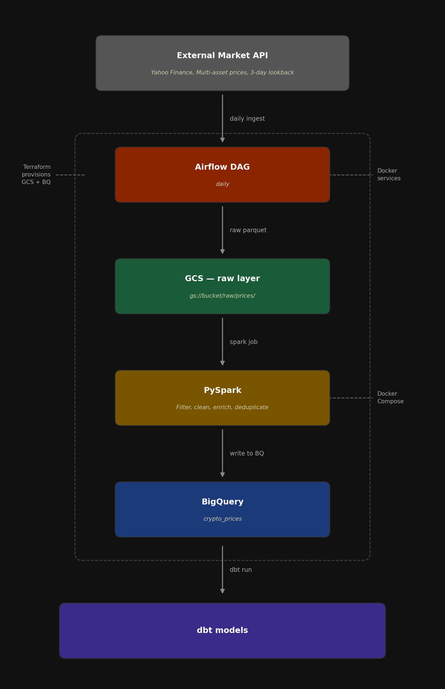
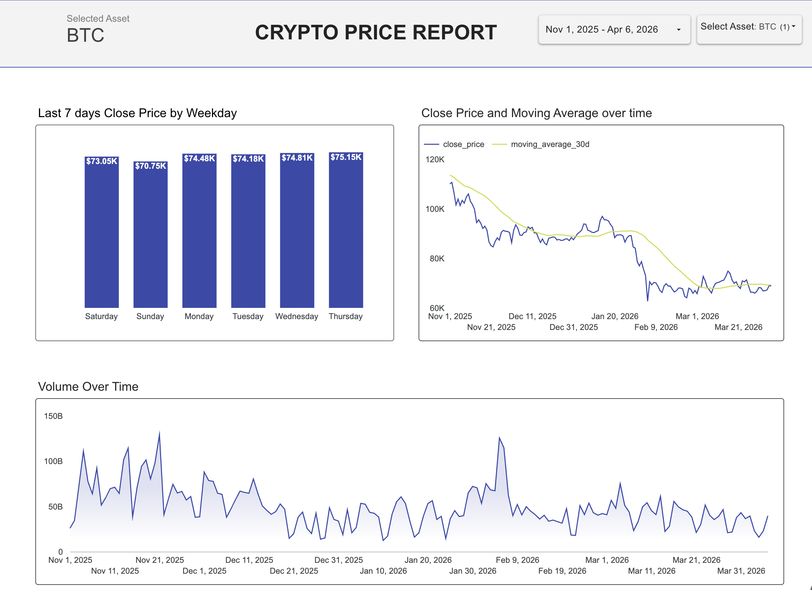

# Data Engineering Pipeline

End-to-end data engineering project using **Airflow**, **Spark**, **dbt**, and **GCS/BigQuery** on Google Cloud Platform. Designed for easy reproducibility using GitHub Codespaces.

This project builds a fully automated, containerised data pipeline for ingestingand transforming multi-asset financial market data — with a focus on crypto prices.
It was built to solve a real problem: taking raw market data delivered daily via an external API, making it reliable, queryable, and ready for analysis .

The pipeline handles the full journey from raw API ingestion through to structured BigQuery tables that dbt models build on. 

## Architecture

```
GCS (raw parquet)
    ↓  Airflow DAG (daily @ 2am)
Spark (transform + enrich)
    ↓
BigQuery staging
    ↓  dbt
BigQuery warehouse → mart
```

```mermaid
flowchart TD
    A[External market API (yahoo finance)] -->|daily ingest| B[Airflow DAG]
    B -->|raw parquet| C[GCS — raw layer]
    C -->|spark job| D[PySpark]
    D -->|write to BQ| E[BigQuery staging]
    E -->|dbt run| F[dbt models]

```
 

## Tech Stack

- **Orchestration**: Apache Airflow 
- **Processing**: Apache Spark (PySpark)
- **Transformation**: dbt-bigquery 
- **Storage**: Google Cloud Storage
- **Warehouse**: BigQuery
- **Infrastructure**: Terraform
- **Environment**: Docker Compose + GitHub Codespaces

---

## Prerequisites

- Google Cloud Platform account with a project created
- GitHub account (for Codespaces)

---

## Setup Instructions

### 1. Open in GitHub Codespaces

Fork or clone this repository and open it in a GitHub Codespace. You can also just run codespace directly. This ensures a consistent Linux environment without any local setup required.

---

### 2. Create and configure your GCP service account

Download your key file and **rename it to `gcp-key.json`**

---

### 3. Set up Terraform

Navigate to the terraform directory and create a keys folder:

```bash
cd terraform
mkdir keys
```

Upload your `gcp-key.json` file into the `terraform/keys/` folder.

Install Terraform:

```bash
wget https://releases.hashicorp.com/terraform/1.7.0/terraform_1.7.0_linux_amd64.zip
unzip terraform_1.7.0_linux_amd64.zip
sudo mv terraform /usr/local/bin/
```

Confirm the installation:

```bash
terraform --version
# Should output: Terraform v1.7.0
```

---

### 4. Configure Terraform variables

Open `terraform/variable.tf` and update the following:

- `project` — replace with your GCP project ID
- `gcs_bucket_name` — replace with a globally unique bucket name (e.g. `yourname-de-bucket`)

---

### 5. Provision GCP infrastructure

```bash
terraform init
terraform plan
terraform apply
```

This creates your GCS bucket and BigQuery dataset.

---

### 6. Set up secrets

Return to the project root and copy your key file into the `secrets/` directory:

```bash
cd ..
mkdir -p /workspaces/data-engineering/secrets && \
cp /workspaces/data-engineering/terraform/keys/gcp-key.json \
   /workspaces/data-engineering/secrets/gcp-key.json
```

Also copy the key into the docker secrets folder:

```bash
mkdir -p /workspaces/data-engineering/docker/secrets && \
cp /workspaces/data-engineering/terraform/keys/gcp-key.json \
   /workspaces/data-engineering/docker/secrets/gcp-key.json
```

---

### 7. Create the `.env` file

Install the cryptography library to generate a Fernet key:

```bash
pip install cryptography
```

Add the Airflow UID:

```bash
echo "AIRFLOW_UID=$(id -u)" >> .env
```

Generate and add the Fernet key:

```bash
echo "AIRFLOW__CORE__FERNET_KEY=$(python -c "from cryptography.fernet import Fernet; print(Fernet.generate_key().decode())")" >> .env
```

Also set the Airflow UID inside the docker/airflow directory:

```bash
cd docker/airflow && echo "AIRFLOW_UID=$(id -u)" >> .env
cd ../..
```

Now open the `.env` file and fill in your GCP values. It should look like this:

```env
AIRFLOW_UID=1000
AIRFLOW__CORE__FERNET_KEY=your-generated-fernet-key
GCP_PROJECT_ID=your-gcp-project-id
GCS_BUCKET=your-gcs-bucket-name
GCP_DATASET=crypto_dataset
```

> You can leave `GCP_DATASET` as `crypto_dataset` unless you changed it in Terraform.

---

### 8. Set up Airflow directories

From the project root:

```bash
cd /workspaces/data-engineering/
mkdir -p ./dags ./logs ./plugins
sudo chown -R 1000:0 ./dags ./logs ./plugins
chmod -R 775 ./dags ./logs ./plugins
```

---

### 9. Build and start Docker

```bash
docker-compose build
docker-compose up -d
```

Wait for all containers to be healthy. You can check with:

```bash
docker compose ps
```

You should see these containers running:

| Container | Status |
|---|---|
| `de_postgres` | healthy |
| `de_airflow_scheduler` | running |
| `de_airflow_webserver` | healthy |
| `de_spark_master` | running |
| `de_spark_worker` | running |

The Airflow UI is available at `http://localhost:8080` (login: `admin` / `admin`).
The Spark UI is available at `http://localhost:8090`.

---

### 10. Initialise dbt

Enter the Airflow scheduler container:

```bash
docker exec -it de_airflow_scheduler bash
```

Initialise dbt (run this from inside the container):

```bash
dbt init
```

When prompted, enter the following:

| Prompt | Value |
|---|---|
| Adapter | `bigquery` |
| Authentication method | `service_account` |
| Key path | `/opt/airflow/secrets/gcp-key.json` |
| Project ID | your GCP project ID |
| Dataset | your BigQuery dataset (e.g. `crypto_dataset`) |
| Threads | `6` |
| Timeout | `300` |
| Location | `EU` |

Verify dbt is connected correctly:

```bash
dbt debug
```

A successful connection shows only this expected error (not a real problem):

```
1 check failed:
Error from git --help: User does not have permissions for this command: "git"
```

Exit the container:

```bash
exit
```

---

### 11. Update profiles.yml

Open `dbt/profiles.yml` and replace the `project` field with your GCP project ID.

---

### 12. Trigger the pipeline

Go to the Airflow UI at `http://localhost:8080`, find the DAG `multi_asset_incremental_ingestion`, and trigger it manually using the play button.

The pipeline will:
1. Ingest raw data into GCS
2. Run the Spark transformation job and write to BigQuery staging
3. Run dbt models to build warehouse and mart layers

---

## Project Structure

```
data-engineering/
├── .env                        # environment variables (gitignored)
├── docker-compose.yaml
├── README.md
├── secrets/
│   └── gcp-key.json            # service account key (gitignored)
├── terraform/
│   ├── keys/                   # gitignored
│   ├── main.tf
│   ├── variable.tf
│   └── terraform.tfvars
├── docker/
│   ├── airflow/
│   │   ├── Dockerfile
│   │   └── requirements.txt
│   └── spark/
│       └── Dockerfile
├── dags/
│   └── multi_asset_incremental_ingestion.py
├── spark/
│   └── jobs/
│       └── process_crypto.py
├── dbt/
│   ├── dbt_project.yml
│   ├── profiles.yml
│   └── models/
│       ├── staging/
│       ├── warehouse/
│       └── mart/
├── logs/                       # gitignored
└── plugins/
```
The dashboard was built using the data model. You can access the dashboard [here](https://datastudio.google.com/reporting/bf23e7d6-a7bc-4aa2-8203-2bdcce49035e)

